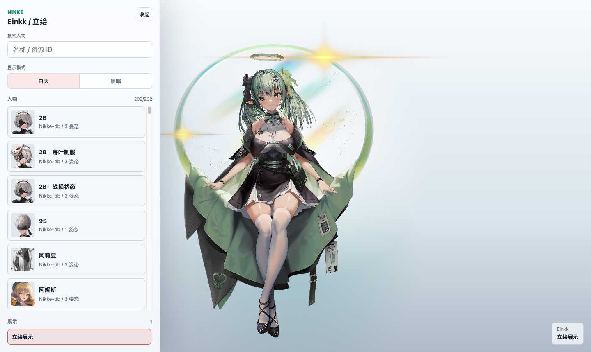
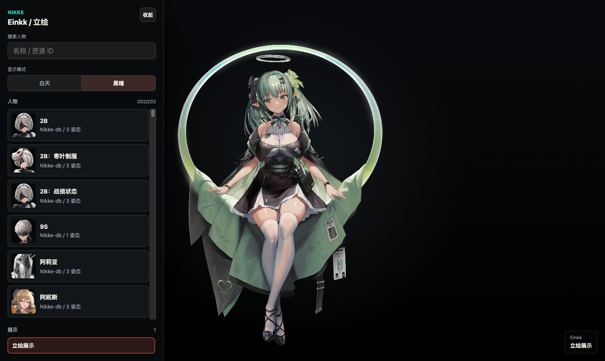

# Nikkiweb

一个用来欣赏 NIKKE 角色 Spine 动画的网页播放器。

它不是视频播放器，而是直接在浏览器里播放角色的 Spine / Live2D 资源。打开页面后，会随机出现一位角色并自动播放立绘展示；如果想换角色、换展示模式，可以从左侧滑出的菜单里切换。

[打开示例页面](https://clam314.github.io/Nikkiweb/)

<p align="center">
  
  
</p>

## 可以做什么

- 随机展示 NIKKE 角色
- 自动播放适合观赏的立绘动作
- 支持开火循环展示
- 支持中文角色名显示
- 支持角色搜索
- 支持白天 / 黑暗模式
- 菜单默认隐藏，鼠标移到左侧时滑出
- 加载资源时显示提示，避免点击后像是页面没反应

## 怎么使用

打开页面后基本不用操作，它会自动开始播放。

想换角色时，把鼠标移到屏幕最左侧，菜单会滑出来。里面可以搜索人物，也可以切换展示模式。

快捷键：

```text
M      固定 / 收起菜单
Space  暂停 / 继续播放
R      重新加载当前动画
```

## 资源说明

Nikkiweb 本身不打包完整游戏资源。页面运行时会读取公开静态资源索引，并按角色资源 ID 加载对应的 Spine 文件。

中文名来自本地预生成的映射表：

```text
data/name-locales.js
```

它会把类似 `c010`、`c310`、`c361` 这样的资源 ID 转成更容易阅读的中文角色名。没有匹配到中文名时，会自动回退到英文名。

## 项目结构

```text
.
├── index.html
├── styles.css
├── app.js
├── data
│   ├── characters.js
│   └── name-locales.js
├── docs
│   └── images
│       ├── preview-light.png
│       └── preview-dark.png
├── vendor
│   ├── spine-player-4.0.30
│   └── spine-player-4.1
└── scripts
    └── deploy-github.sh
```

## 说明

这是一个非官方项目，主要用于学习和展示 Spine 动画播放效果。

页面播放的是 Spine 动画资源，不是普通视频。部分角色资源可能不完整，遇到不可用姿态时页面会自动跳过或回退。

## 致谢

感谢 [Nikke-db / Nikke-db.github.io](https://github.com/Nikke-db/Nikke-db.github.io) 这个开源项目整理和维护 NIKKE 的公开静态资源。
